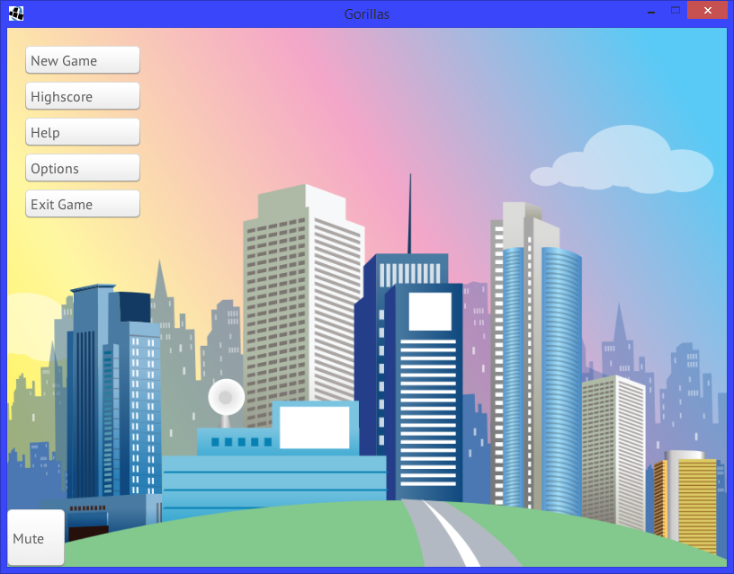
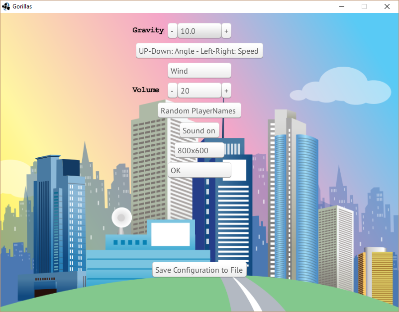
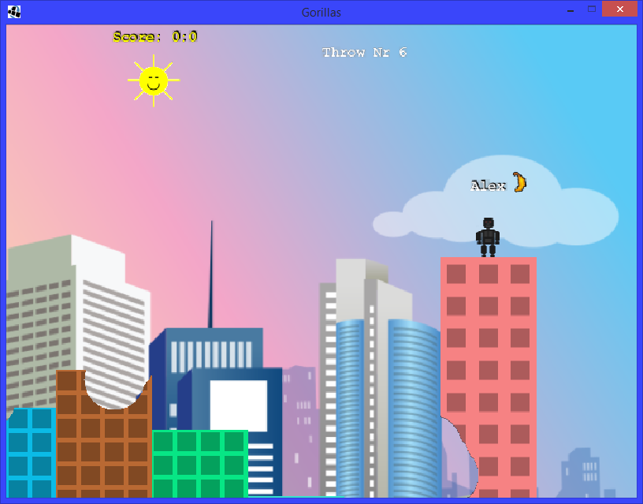
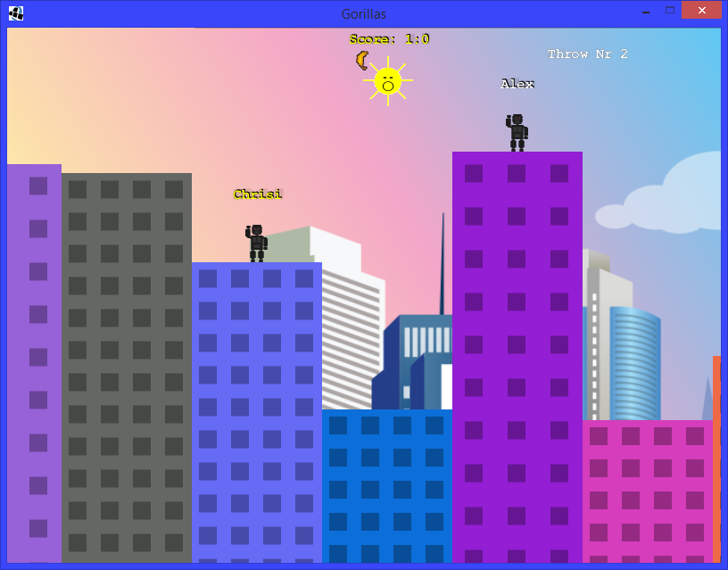
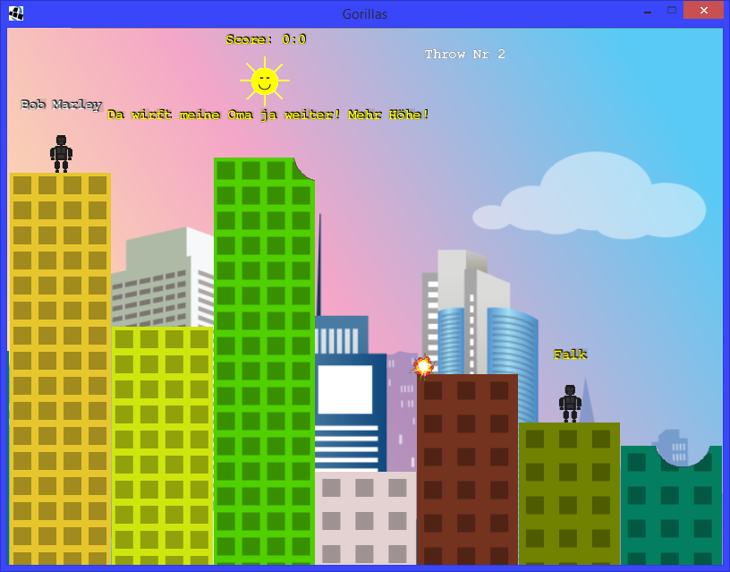
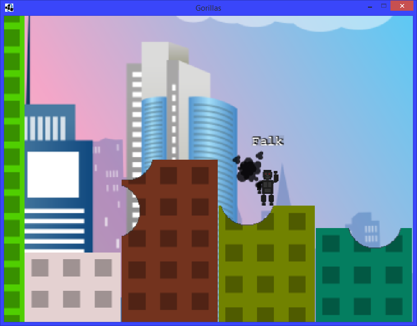
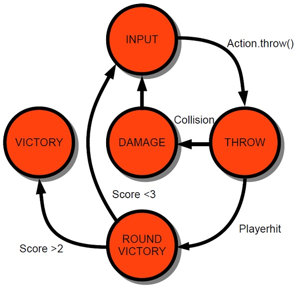
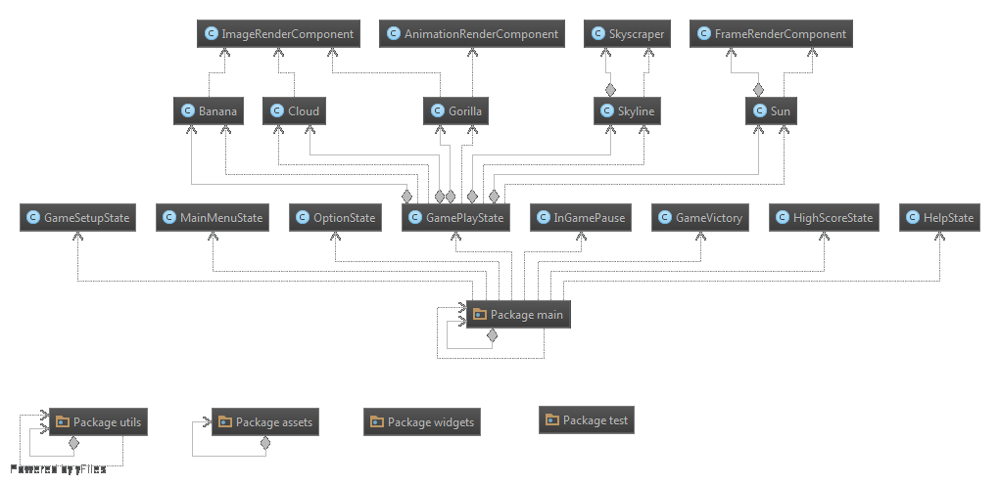

# Gorillas
Gorillas was the final project for the Intro To Computer science class (GDI1) in the Winter Semester 2014 (WS2014) at Tu Darmstadt
Gorillas is a remake of and old [dos game](https://en.wikipedia.org/wiki/Gorillas_(video_game))

## Major Features
- Procedural Map Generation
- Destructible Environment
- Dynamic Action Cam (Zoom, Movement, SlowMo)
- SQL Based Highscore System
- Animations, Sounds, Different Projectiles and more...

## Screenshots

</img> </img> </img>

</img> </img> </img>

## Implementation Overview
We went for an hybrid entity component based implementation, with a small inheritance chain.

### Game State Machine

### Game Architecture

## Frameworks
[Slick2D] (http://slick.ninjacave.com/)
[LwJGL] (http://www.lwjgl.org/)
[SQLite JDBC Driver] (https://github.com/xerial/sqlite-jdbc)
[EEA Framework] (https://www.linkedin.com/in/guidoroessling)

## Disclaimer
Published under the [MIT License](LICENSE.md).